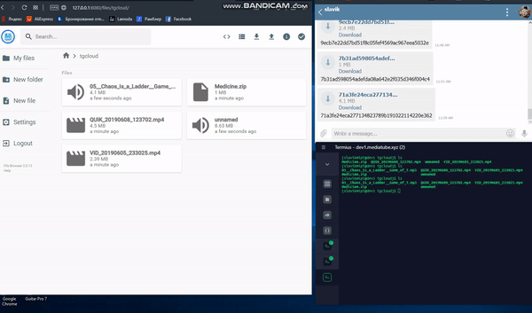

# tgcloud
## UNDER DEVELOPMENT v1.1

- `secret.py` : rename `secret.py.template`, insert `api_hash` and `api_id` obtained with  https://my.telegram.org

- Install Python2.7 and Python3.6

- Clone the repository
```
cd ~
git clone https://github.com/SlavikMIPT/tgcloud.git
```
- Install requirements for Python3.6

`sudo pip3 install -r requirements.txt`
- Create a session by running  **from the project folder**

`python3.6 telegram_create_session.py`

- Install fuse bindings

`sudo yum install python-fuse`

- Create Mount Folder

`mkdir storage`

- Run VFS **from the project folder**: 

#### debug:

`python2.7 dedupfs/dedupfs.py -df --block-size 20971520 -o auto_unmount -o hard_remove storage/`

#### as a service:

replace `<username>` in `tgcloud.service`
```
sudo cp tgcloud.service /ect/systemd/system/
sudo systemctl enable tgcloud.service
sudo systemctl daemon-reload
sudo systemctl start tgcloud.service
sudo systemctl status tgcloud.service -l
```

Version 1.1

It works more vigorously, but still a raw prototype - just POC 

Can crash, it is unstable and slow in some cases .

For tests, it is better to use a separate telegram profile.

If banned - mail `recover@telegram.org`

You can try to use web based  or SFTP

You are welcome to collaborate - contact 
Telegram: [@SlavikMIPT](t.me/SlavikMIPT)
Channel: [@MediaTube_stream](t.me/MediaTube_stream)
